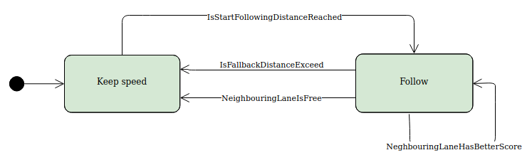

# Documentation of the project code

The project implementation is divided into several parts, each of which I will explain in more details:
1. Choosing the coordinates (or state variables) that will represent model behavior
2. Implementing the controller, to regulate the states according to the setpoints and given limitations
3. Implementing the state machine which will define top level behavior according to the assignment description

## Choosing the state variables
By using the Frenet coordinates for the model, it is possible to have independent controllers for the control of (s) and (d) coordinates. It is also straightforward to define setpoints for regulation. For example target (s0 position can be easily derived from the (s) position of the car in front, and target (d0 position could simply be based on the current lane where we want car to move.

So in summary, when we want to regulate speed of the car (for example when we maintain the speed and there are no cars in front), or when we want the car to follow specific position target (when we are following the car in front), we achieve this by changing the setpoints of the s coordinate. When we want for the car to move to a specific track, we are changing the setpoint of the d coordinate.

One detail to be aware of is that since we can have both regulations present at the same time, the actual speed and acceleration of the car will be the result of changing both the (s) and (d) coordinates. However, given that the components of speed and acceleration along (d) are much lower by magnitude when compared to (s), taking somewhat smaller limits than max can be resolved. To reduce the affect on speed/acceleration when we are moving away from the (s) curve, the curve is chosen to be in the center of second track (d=0).

The data exchange sequence between the simulator and the model is as follows:
1. Simulator provides the some of the previous x,y points that the model predicted in previous iteration.
2. Iterate the model until the output (x,y) matches the first (x,y) pair from the previous set. This will be the point where we can continue our model prediction into future.
3. Run single step of the model by using the provided sensor_fusion data.
4. Iterate the model predefined steps into future, assuming external data is stationary (ie speed of the cars are constant).
5. Convert model states from (s,d) to (x,y) coordinates by using function Frenet2Cartesian(main.cpp:18). Send new (x,y) data to the simulator.

## Controller for (s,d) coordinates
I am quoting here the rationale I submitted for the review, as a explanation for the chosen control method:

"
I have spent some time trying to apply trajectory generation theory for this project, but due to some issues I abandoned this approach.

The main problem was that ensuring speed, acceleration and jerk (and lane!) limits to be satisfied one would need to use non-trivial methods, which would probably require a search of some sort to find proper T and possibly some other parameters as well. This could be required especially when trajectory needs to be updated while the previous trajectory has not yet finished leaving us with an arbitrary position, velocity and acceleration values that will become the starting values for the updated trajectory. This seemed like a challenge that could potentially take much of my time so I opted for another approach.

To guarantee that limits in the assignment are satisfied, I used the dynamic model (double integrator) and then applied states space control with limitations to the regulating signal for that purpose. For example acceleration regulating signal has rate-change limitation to satisfy the jerk limits, and saturation to satisfy acceleration limits. Speed saturation was applied for the speed regulation to satisfy speed limits. To ensure there is no position overshooting the controller gains were chosen to provide aperiodic response with no overshoot. In the end, the controller was working fine but of course, the trajectories it creates are not 'jerk-minimizing' optimal.
"

So, the controller is based on state space model, but here it is actually used as a trajectory generator (since there is not actual disturbance present).

First, the state gain was chosen for the control of the vehicle speed, so that we can have desired rise time for the speed state. Since input for the speed model dv/dt = a, we apply jerk and saturation limits here respectively (controller.cpp:66 and controller.cpp:70). Jerk limit is ensured by limiting maximum change in acceleration over the sample time Ts (0.02s). The loop gain is set to be exactly 1 so that the input is a reference point for model to follow.

Outer (position) loop provides setpoint for the vehicle speed loop when we want the car to follow a set position. The time constant is chosen to be ~3 times lower than the speed loop, by setting the state gain for the position state accordingly. Important here is that since the sensor fusion data provides estimates for both position and speed, we can use both of these to ensure that we can converge to given position even when it is changing in time (with constant speed). This is of course very important when we want to follow the car in front.

The controller for the d coordinate is chosen similarly, with the exception that we only regulate the position. Also, the limiting values are chosen to be smaller than for the (s) coordinate which is due to much smaller changes in the setpoint when changing lanes.

## Behavioral state machine

The structure of the behavioral state machine is shown in the image bellow.

Stm can be in "prediction mode" or default mode. The purpose of the prediction mode is to project future behavior of the model assuming that during that time all external data is at "steady state". This is of course necessary during the time while there is no sensory information from the simulator.

If the stm is in prediction mode, model states (s,d) are updated based only on predicted setpoint values, without the sensor fusion data:
1. State "Keep Speed": The speed setpoint is maintained at the max speed value (behavior_stm.cpp 134-135)
2. State "Follow": It is assumed that the lead car (target) is continuing to move with constant speed (behavior_stm.cpp 31-35)

### Keep speed
In the "Keep speed" state, the car stays in the same lane and maintains the maximum allowed speed by sending the max speed setpoint to the (s) state controller.

IsStartFollowingDistanceReached: Distance of the car ahead is compared to the StartFollowingDistance and if it is less, the stm will transition to Follow state. (behavior_stm.cpp 141-151)

### Follow
In the "Follow" state, the car is following the lead car at a predefined distance (Following distance). At the same time lane scores are calculated for neighbouring and the current track, depending on which several transitions are possible.

IsFallbackDistanceExceeded: If the car in front draws away at enough distance (Fall_behind_distance > Following_distance), then we transition to Keep speed and remain in the same track.

NeighbouringLaneIsFree: If one of the neighbouring lanes is free from cars ahead (or are further away then Lookahead_limit), then we move to that lane and transition to Keep speed state.

NeighbouringLaneHasBetterScore: If one of the neighbouring lanes has the best score of all including the current, then we move to that lane but stay in the Follow state. The score will be better only if the speed of the leading car in that lane is greater, and there are no limitations to move to that lane (due to vicinity of the cars etc).

For more details on how the lane score is calculated refere to the method lane_score(behavior_stm.cpp 217).

